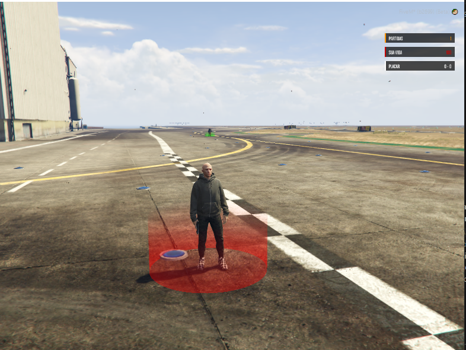
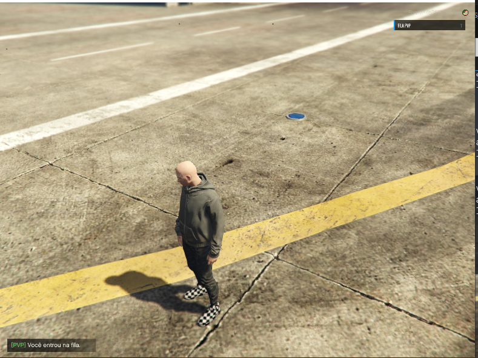
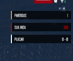
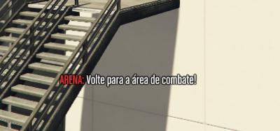
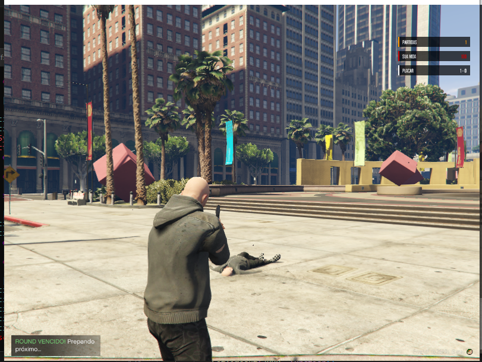
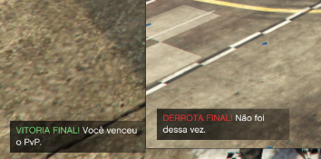
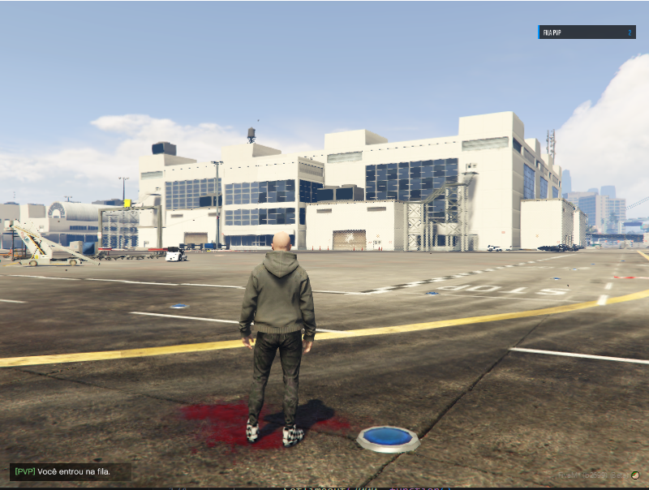
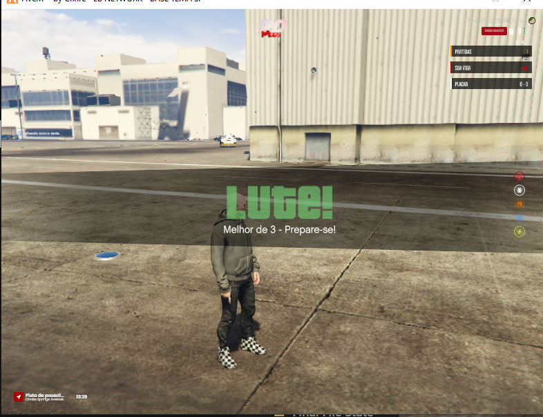

# 🎮 PvP System Challenge (Standalone)

Sistema de fila e gerenciamento de partidas PvP 1v1 desenvolvido para o desafio técnico da **PLF PVP**. Este recurso foi projetado com foco em **performance**, **isolamento** e **experiência do usuário**, seguindo padrões de desenvolvimento Senior.

## 🚀 Funcionamento da Fila

O sistema utiliza uma abordagem de **Matchmaking Reativo**:
1. O jogador entra na fila utilizando o comando configurado (`/pvp`).
2. Uma thread do servidor monitora a fila em intervalos otimizados.
3. Assim que dois jogadores válidos são encontrados, uma partida é instanciada e ambos são removidos da fila.
4. O sistema valida se os jogadores ainda estão online antes de iniciar o teleporte, garantindo que a fila nunca trave por desconexões.

## ⚔️ Gerenciamento das Partidas (Melhor de 3)

As partidas são tratadas como objetos independentes no servidor:
- **Isolamento via Routing Buckets**: Cada partida ocorre em um `RoutingBucket` exclusivo. Isso garante isolamento total entre diferentes duelos simultâneos.
- **Formato de Competição**: Implementado sistema de "Melhor de 3". O primeiro jogador a atingir 2 vitórias é declarado o vencedor final.
- **Restauração de Estado**: O sistema armazena as coordenadas originais e o bucket de origem. Ao finalizar, o jogador é restaurado com vida cheia (200), colete removido, armas do PvP retiradas e posicionado exatamente onde estava antes do duelo.
- **Sistema Anti-Fuga**: Caso um jogador tente sair dos limites da arena durante o combate, ele é automaticamente teleportado de volta para o seu ponto de spawn inicial com um efeito visual de fade, garantindo que a luta continue de forma justa.
- **UX Dinâmica**: Markers de spawn visualmente intuitivos (Verde/Vermelho) aparecem apenas durante o countdown para orientar o posicionamento inicial, desaparecendo assim que o combate começa para garantir um campo de visão limpo.

## 🛠️ Decisões Técnicas Principais

### 1. GlobalState & State Bags
Utilização de `GlobalState` para sincronização do HUD (contagem de fila/partidas). Isso reduz o overhead de rede, pois o cliente acessa os dados de forma síncrona sem necessidade de disparar eventos constantes.

### 2. Otimização de Threads
O loop de renderização da UI possui timers dinâmicos, garantindo que o recurso consuma 0.00ms de CPU quando o jogador não está interagindo com o sistema PvP.

### 3. Segurança Standalone
Desenvolvido sem dependências de frameworks externos (vRP/ESX/QB), utilizando nativas puras para garantir compatibilidade universal. A lógica de morte e renascimento foi blindada no servidor para evitar manipulações via executores.

## 📸 Demonstração do Sistema

````carousel

Visualização dos spawns (markers verde e vermelho) e efeitos de preparação no início da partida.
<!-- slide -->

Contador minimalista de jogadores na fila de espera.
<!-- slide -->

HUD completa durante o combate com Placar, Vida e contador de partidas ativas.
<!-- slide -->

Sistema de alerta visual e sonoro quando o jogador tenta sair da arena.
<!-- slide -->

Feedback visual quando o jogador vence um round.
<!-- slide -->

Feedback visual quando o jogador perde um round.
<!-- slide -->

Anúncio do vencedor final da partida após completar a Melhor de 3.
<!-- slide -->

Demonstração da sincronização correta da fila para múltiplos jogadores.
<!-- slide -->

Animação de "LUTE!" e liberação dos jogadores para o combate.
````

---
**Desenvolvido por:** Caio William Oliveira Faria.
**Status:** Concluído com 100% dos requisitos atingidos e melhorias extras de UX.
